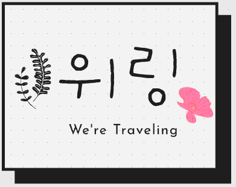

## 스파르타내일배움캠프 첫 번째 프로젝트(Weling)
   

  

 

### 🔗라이브
[weling.site](http://weling.site/)  

### ✈️ 소개
위링(we-ling)은 여행을 기반으로한 정보 공유 및 커뮤니티 기능을 가지고 있습니다.
We are traveling의 약자이며 여행자들을 대상으로 서비스를 제공합니다.  
    
### 🛠 기능 요약
1. 웹사이트 이용자가 여행 전, 여행 계획 및 예산안을 작성, 공유하고 이용자들의 의견을 얻을 수 있도록 정보 공유를 목적으로 하는 커뮤니티 기능을 가집니다.
2. 웹사이트 이용자가 여행 후, 여행 날짜/여행 사진/제목/여행 주소/여행 내용(예산안, 이동 경로)를 작성하고 이를 열람함으로써 여행 일지를 공유할 수 있습니다.  

### ⏰ 개발 기간
1️⃣차 프로젝트 : 2021년 9월 23일 ~ 2021년 09월 30일  
2️⃣차 프로젝트 : 2021년 10월 12일 ~ 2021년 10월 19일

### 👩‍💻 멤버 구성
- 정태희(팀장)
- 김혜린
- 서성혁
- 우성호  

### 📌 기술
- HTML, CSS, JavaScript, Ajax, Jinja, jQuery
- pycharm, Robo3-T
- Flask, jinja2, aws, mongodb,pyJWT

### 📌 기술 선택 이유 [ - 상세보기](https://github.com/jtheeeeee/we_are_traveling/wiki/%EA%B8%B0%EC%88%A0-%EC%84%A0%ED%83%9D-%EC%9D%B4%EC%9C%A0)

### 📌 주요 기능 [ - 상세보기](https://github.com/jtheeeeee/we_are_traveling/wiki/%E2%9C%85WELING-%EC%A3%BC%EC%9A%94-%EA%B8%B0%EB%8A%A5)
 

### 📌 문제 해결! [ - 상세보기](https://github.com/jtheeeeee/we_are_traveling/wiki/%ED%8A%B8%EB%9F%AC%EB%B8%94-%EC%8A%88%ED%8C%85)
